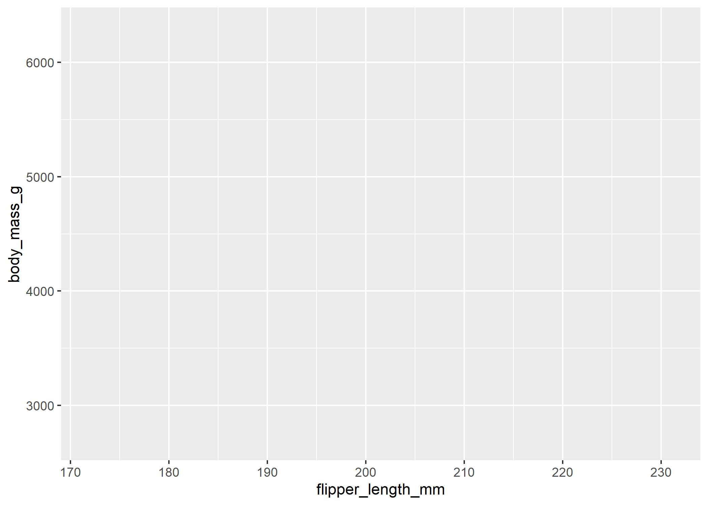
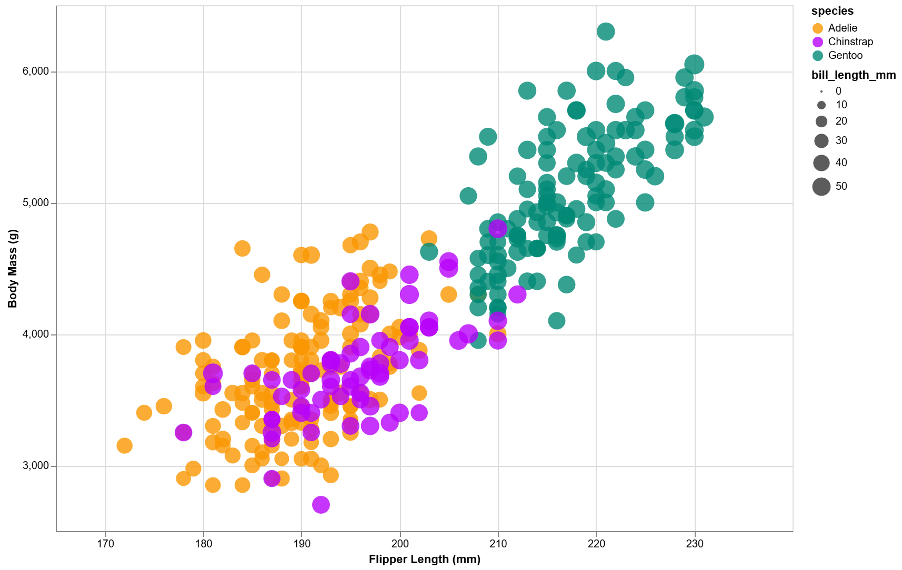
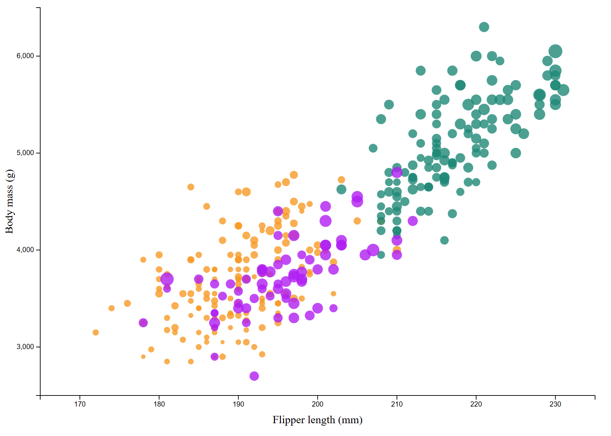
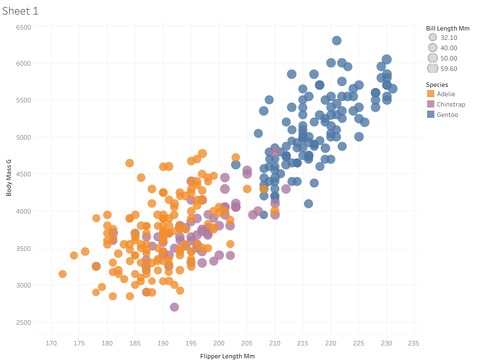
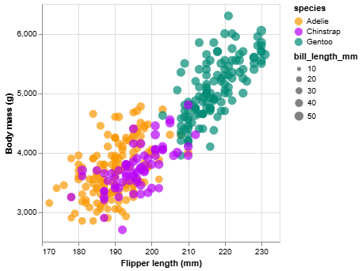

Readme Requirements
---

A good readme with screenshots and structured documentation is required for this project. 
It should be possible to scroll through your readme to get an overview of all the tools and visualizations you produced.

- Each visualization should start with a top-level heading (e.g. `# d3`)
- Each visualization should include a screenshot. Put these in an `img` folder and link through the readme (markdown command: ``.
- Write a paragraph for each visualization tool you use. What was easy? Difficult? Where could you see the tool being useful in the future? Did you have to use any hacks or data manipulation to get the right chart?

Other Requirements
---

0. Your code should be forked from the GitHub repo.
1. Place all code, Excel sheets, etcetera in a named folder. For example, `r-ggplot, matlab, mathematica, excel` and so on.
2. Your writeup (readme.md in the repo) should also contain the following:

- Description of the Technical achievements you attempted with this visualization.
  - Some ideas include interaction, such as mousing over to see more detail about the point selected.
- Description of the Design achievements you attempted with this visualization.
  - Some ideas include consistent color choice, font choice, element size (e.g. the size of the circles).

**NOTE: THE BELOW IS A SAMPLE ENTRY TO GET YOU STARTED ON YOUR README. YOU MAY DELETE THE ABOVE.**

# R + ggplot2 + plotly + HTML widgets

R is a language used for statistical computing and data visualization. ggplot2 is a data visualization library in R. plotly is a graphing library that allows for interactive graphs.
HTML widgets is a framework that can embed interactive visualizations without requiring Javascript coding.

I created a static visualization of the penglings dataset using ggplot2's "geom_point()", aesthetic functions for the color and size of the data points, and labs() for the axis labels. The colors are hex codes that match the colors of the graph we were tasked with replicating. Creating a manual scale and using hex codes let me keep consistent colors across all of my graphs.
I created an interactive visualization using plotly. When mousing over a point, a box appears showing the Flipper length, body mass, species, and bill length of the penguin that is represented by that data point. The box disappears when the mouse is removed.

Examples and documentation for ggplot2 and plotly were abundant and easy to find. ggplot2 allows for a diverse visualization with little code. The biggest barrier was familiarizing myself with the goem_point() and aes() functions since I had no previous experience with these.

## Link to interactive plot
https://morganvazy.github.io/a2-DataVis-5ways/R/penglings_R_interactive.html
## Technical Achievements
- Hover feature that shows the penguin's flipper length, body mass, species, and bill length using plotly.
## Design Achievements
- created a manual color scale with hex codes so colors were accurate to the original reference picture (hex codes: Adelie - #FA9702, Chinstrap - #B802FA, Gentoo - #018A75)
## Sources & References
- https://www.sthda.com/english/wiki/ggplot2-scatter-plots-quick-start-guide-r-software-and-data-visualization - reference for scatterplot
- https://ggplot2.tidyverse.org/reference/labs.html - used for axis labels
- https://stackoverflow.com/questions/37465285/interactive-scatter-plots-in-r-overlay-hover-summary-tooltip-as-user-supplied-p - used for hover feature

# Vega-Lite + Javascript
Vega-Lite is a high level grammar used to create interactive visuals with a JSON syntax.
I created a scatterplot of the penglings data with a tooltip for hovering over data points. I explicitly coded in the values for tick marks to match the tick marks on the R graph. For the colors representing each pengin species, I used the same hex codes as for the R graph and created a scale that mapped the hex codes to each species. When hovering over a data point, the flipper length, body mass, species, and bill length appear in a box to the side of the point.

There are many strong resources on vega-lite and many examples of scatterplots. Adding the tooltip for interactivity was relatively straightforward and was easily scalable to display many fields when hovering. I felt like the relative sizes of each data point based on bill length were appropriate and made for a legible graph. After replicating the graph, there was very little additional customization necessary in order to make the graph legible. I think Vega-Lite is a strong choice for someone looking for customizability without overhwleming syntax.

## Link to interactive plot
https://morganvazy.github.io/a2-DataVis-5ways/Vega-Lite/penglings_Vega-Lite_interactive.html
## Technical Achievements
- Hover feature that shows the penguin's flipper length, body mass, species, and bill length using a tooltip.
## Design Achievements
- created a manual color scale with hex codes so colors were consistent across graphs (hex codes: Adelie - #FA9702, Chinstrap - #B802FA, Gentoo - #018A75)
- consistent tick marks values on x and y axis as all other graphs
## Sources & References
- https://vega.github.io/vega-lite/examples/point_2d.html
- https://vega.github.io/vega-lite/tutorials/explore.html
- https://vega.github.io/vega-lite/docs/scale.html
- https://vega.github.io/vega-lite/docs/axis.html

# d3 + Javascript
Add stuff here

## Link to interactive plot
https://morganvazy.github.io/a2-DataVis-5ways/d3/penglings_D3.html
## Technical Achievements
- Hover feature that shows the penguin's flipper length, body mass, species, and bill length using a tooltip.
## Design Achievements
- created a manual color scale with hex codes so colors were consistent across graphs (hex codes: Adelie - #FA9702, Chinstrap - #B802FA, Gentoo - #018A75)
- consistent tick marks values on x and y axis as all other graphs
## Sources & References
- https://vega.github.io/vega-lite/examples/point_2d.html
- https://vega.github.io/vega-lite/tutorials/explore.html
- https://vega.github.io/vega-lite/docs/scale.html
- https://vega.github.io/vega-lite/docs/axis.html

# Tableau
Add stuff here

## Link to interactive plot
https://public.tableau.com/app/profile/morgan.vasiliou/viz/penglings-tableau/Sheet1?publish=yes
## Technical Achievements
- Hover feature that shows the penguin's flipper length, body mass, species, and bill length using a tooltip.
## Design Achievements
- created a manual color scale with hex codes so colors were consistent across graphs (hex codes: Adelie - #FA9702, Chinstrap - #B802FA, Gentoo - #018A75)
## Sources & References

# Vega Altair + Python
Add stuff here

## Link to interactive plot
https://morganvazy.github.io/a2-DataVis-5ways/altair/penglings_altair.html
## Technical Achievements
- Hover feature that shows the penguin's flipper length, body mass, species, and bill length using a tooltip.
## Design Achievements
- created a manual color scale with hex codes so colors were consistent across graphs (hex codes: Adelie - #FA9702, Chinstrap - #B802FA, Gentoo - #018A75)
- consistent tick marks values on x and y axis as all other graphs
## Sources & References
- https://vega.github.io/vega-lite/examples/point_2d.html
- https://vega.github.io/vega-lite/tutorials/explore.html
- https://vega.github.io/vega-lite/docs/scale.html
- https://vega.github.io/vega-lite/docs/axis.html
